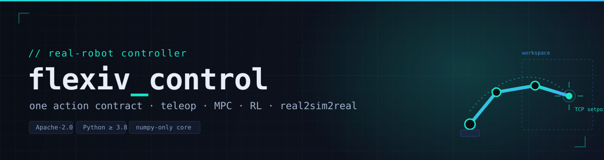

<div align="center">



<h1>flexiv_control</h1>

<p><b>A unified, real-time control &amp; safety layer for the Flexiv Rizon.</b><br/>
One action contract for teleoperation, MPC, reinforcement learning, and real-to-sim-to-real manipulation.</p>

<p>
<a href="https://github.com/ZihaoLu001/flexiv_control/actions/workflows/ci.yml"></a>


</p>

<p>
<a href="https://zihaolu001.github.io/flexiv_control/"><b>Landing page</b></a> ·
<a href="#quick-start"><b>Quick start</b></a> ·
<a href="docs/architecture.md"><b>Architecture</b></a> ·
<a href="docs/action_contract.md"><b>Action contract</b></a> ·
<a href="docs/safety.md"><b>Safety</b></a>
</p>

<p><sub><i>Community project — <b>NOT affiliated with, endorsed by, or supported by Flexiv Robotics.</b></i></sub></p>

</div>

---

`flexiv_control` is a thin, fast layer between a high-level decision maker — a
policy, an MPC planner, a teleoperator — and a Flexiv Rizon arm. It takes a
high-level action, turns it into a **safe** stream of setpoints at the control
rate, and reports back what actually happened.

Every consumer speaks the **same action contract**, and every backend — a real
Rizon via Flexiv RDK, a dependency-free `fake` backend, or a MuJoCo simulation —
consumes the same safety-filtered setpoint stream. That is what makes one
controller reusable across teleop, RL, MPC, and real2sim2real projects without
forks. The design (a thin client over a real-time-capable loop, one action
interface, sim + real behind a single backend switch) is the shape that Deoxys,
Polymetis, frankapy, SERL/HIL-SERL, and LeRobot converged on
([design rationale](docs/design_rationale.md)).

## Features

- **One action contract** — `CartesianChunk` / `CartesianDelta` / `JointChunk` +
  `GripperCommand`, with absolute or relative-to-chunk-start poses, a
  predict-vs-execute horizon, and a quantified `ExecutionResult`.
- **Safety is first-class** — named, version-controlled `SafetyProfile`s and a
  microsecond per-tick `SafetyFilter` (workspace box, speed/jump caps, joint
  limits, contact-wrench stop, watchdog) that *clips or rejects and reports*.
- **Sim ↔ real behind one switch** — a MuJoCo backend (Jacobian IK, gravity
  compensation) with a **faithful GN01 gripper**, the `fake` backend for offline
  dev, and a real Rizon, all behind one config string.
- **Built for learning & control** — a Gymnasium env, a HIL-SERL intervention
  wrapper, a `RecedingHorizonRunner` (the VLA / MPC policy-server seam), and a
  SpaceMouse teleoperator, all on the same contract.
- **Multi-user safe** — an in-process lease and a host-wide lock so two processes
  can't fight over the arm.
- **See what it WILL do** — `flexiv-control viz` mirrors the robot live in any
  browser on the LAN and previews each chunk's **intended motion** (the true
  per-tick command path, time-colored, with gripper events, a workspace box,
  an animated ghost, and an optional Approve/Reject gate) before it executes —
  for safety and debugging. See [docs/visualization.md](docs/visualization.md).
- **Optional, not required** — a numpy-only cross-process server + `RemoteRobot`,
  a C++ 1 kHz real-time daemon, and a ROS 2 overlay. **The core needs only numpy.**

## Installation

```bash
git clone https://github.com/ZihaoLu001/flexiv_control.git
cd flexiv_control
pip install -e .          # core: numpy only
```

<details>
<summary>Optional extras (RL, teleop, LeRobot, MuJoCo, real hardware, dev)</summary>

```bash
pip install -e ".[rl]"        # + Gymnasium env
pip install -e ".[teleop]"    # + SpaceMouse
pip install -e ".[lerobot]"   # + LeRobot data/training
pip install -e ".[mujoco]"    # + MuJoCo simulation backend
pip install -e ".[viz]"       # + live browser visualization (viser)
pip install -e ".[flexiv]"    # + flexivrdk (real hardware; RDK v1.x)
pip install -e ".[dev]"       # + pytest, ruff
```
See [docs/flexiv_setup.md](docs/flexiv_setup.md) for real-robot bring-up and
[docs/versions.md](docs/versions.md) for RDK/firmware version pinning.
</details>

## Quick start

No hardware needed — the `fake` backend is dependency-free:

```python
from flexiv_control import Robot, RobotConfig, CartesianChunk

robot = Robot(RobotConfig(backend="fake"))     # or "mujoco" / "flexiv_rdk"
robot.connect()
robot.start_cartesian_impedance()

chunk = CartesianChunk.from_waypoint_array([[0.45, 0.0, 0.30, 1.0, 20],
                                            [0.50, 0.0, 0.25, 0.0, 20]])
result = robot.execute_cartesian_chunk(chunk)
print(result.success, result.path_tracking_error)

robot.disconnect()
```

```bash
flexiv-control demo            # offline FakeBackend demo, no hardware
python examples/01_fake_hello.py
```

## Architecture

The action contract is the only thing crossing the boundary, so the network
server, Gym env, and ROS overlay are all pure pass-through:

```
 Language policy   MPC planner   RL trainer   SpaceMouse
        \              |             |            /
         └──►  CartesianChunk / CartesianDelta / JointChunk  ◄──┘
                              │
            Robot facade → SafetyFilter (per-tick) → Interpolator → backend → Rizon
```

The Rizon runs its hard real-time impedance loop **inside the robot**, so the
host only streams setpoints. That gives **two tiers** — a Python default
(100–500 Hz, RDK non-real-time modes) and an optional C++ 1 kHz daemon (RDK
real-time modes) — sharing the same contract. The
[landing page](https://zihaolu001.github.io/flexiv_control/) and
[docs/architecture.md](docs/architecture.md) lay this out in full.

| Path | Purpose |
|---|---|
| `src/flexiv_control/` | core: contract, safety, interpolation, robot facade, backends |
| `src/flexiv_control/sim/` | MuJoCo Rizon + GN01 gripper model builder |
| `cpp/` · `ros2/` | optional Tier-B 1 kHz RT daemon · optional ROS 2 overlay |
| `configs/` · `examples/` · `tests/` | shipped YAML profiles · runnable demos · pytest suite |

## Examples

| File | Shows |
|---|---|
| `examples/01_fake_hello.py` | connect, read state, run a chunk on `fake` |
| `examples/02_cartesian_chunk.py` | the action contract and `ExecutionResult` |
| `examples/03_rl_gym_env.py` | Gymnasium env + HIL-SERL intervention |
| `examples/04_mpc_loop.py` | a high-rate closed loop |
| `examples/05_spacemouse_teleop.py` | teleop (scripted, or `--device`) |
| `examples/06_lerobot_record.py` | recording in the LeRobot format |
| `examples/07_receding_horizon.py` | receding-horizon execution + the VLA/MPC policy-server seam |

## Documentation

| Doc | What |
|---|---|
| [architecture.md](docs/architecture.md) | the stack, the two RT tiers, components, boundaries |
| [action_contract.md](docs/action_contract.md) | the contract objects, conventions, chunk constructors |
| [safety.md](docs/safety.md) | profiles, the filter, the shipped profiles, tuning |
| [flexiv_setup.md](docs/flexiv_setup.md) | bringing up a real Rizon, licenses, first-run checklist |
| [versions.md](docs/versions.md) | RDK version sensitivity and the `# VERIFY:` markers |
| [visualization.md](docs/visualization.md) | live browser mirror + intended-motion preview (`[viz]`) |
| [integration_planner.md](docs/integration_planner.md) · [_mpc](docs/integration_mpc.md) · [_rl](docs/integration_rl.md) · [_teleop](docs/integration_teleop.md) | per-use-case integration guides |

## Safety

> **Before any motion on real hardware:** keep an E-stop within reach and
> validate your `SafetyProfile` — especially the workspace box — on your own cell
> at low speed. See [docs/safety.md](docs/safety.md).

## Status

Alpha (`0.1.0`). The Python core, safety, action contract, server/client,
Gymnasium env, teleop, and the **MuJoCo simulation (including the GN01 gripper)**
are tested in CI (Python 3.8 / 3.10 / 3.12). The **real-hardware** (`flexiv_rdk`)
and the **C++ / ROS 2** paths are hardware-unvalidated and carry `# VERIFY:`
markers to confirm against your installed versions before first use
([docs/versions.md](docs/versions.md)).

## Development

```bash
pip install -e ".[dev]"
ruff check src tests examples
pytest -q
```

Contributions welcome — see [CONTRIBUTING.md](CONTRIBUTING.md).

## Citation

If you use this in academic work, please cite it (see [CITATION.cff](CITATION.cff)).

## License

[Apache-2.0](LICENSE). The MuJoCo GN01 gripper model is derived from the official
Flexiv ROS description (Apache-2.0); see [NOTICE](NOTICE).

<div align="center"><sub>Built for the Flexiv Rizon · community-maintained · not affiliated with Flexiv Robotics</sub></div>
